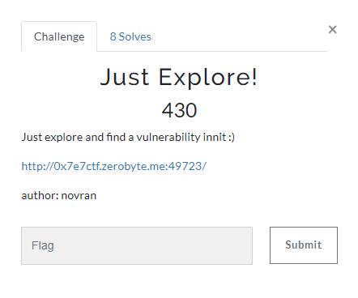
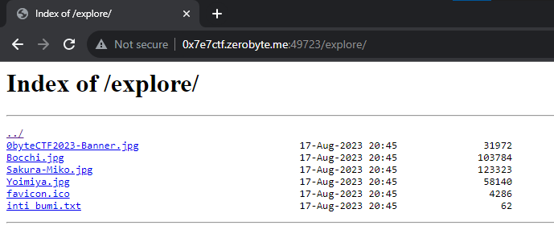
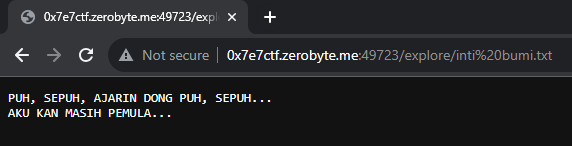
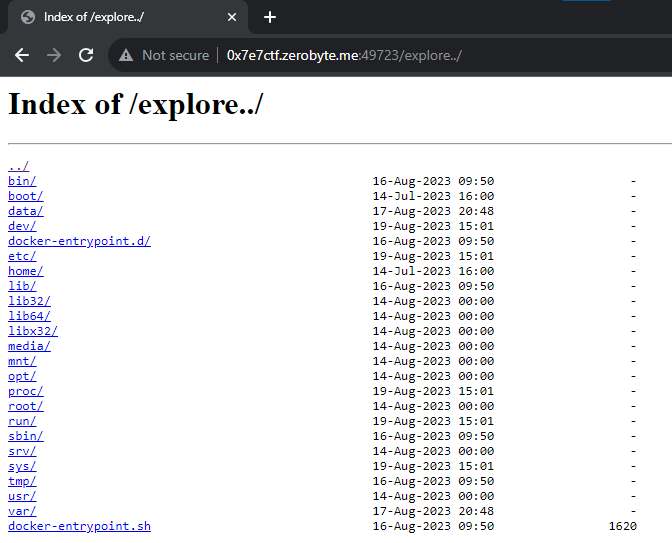
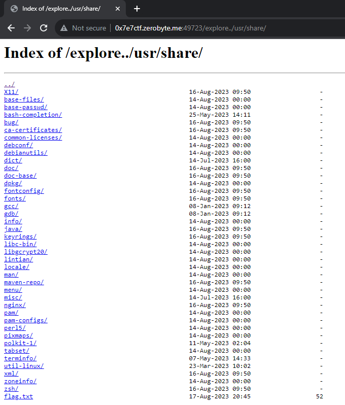
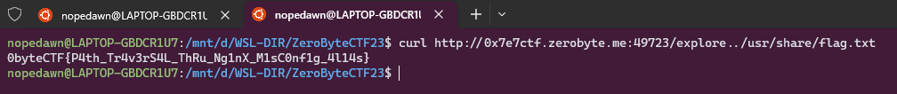

## Just Explore

<details>
  <summary>Deskripsi</summary>
  
  > Just explore and find a vulnerability innit :)
  >
  > http://0x7e7ctf.zerobyte.me:49723/
  >
  > Author: novran
  
</details>

<br/>



Diberikan sebuah challenge web yang disuruh menuju ke halaman (endpoint) explorer






<br/>

Saya menemukan pada Tech Stack terdapat nginx. Kemudian saya mencoba mengutak-atik pada url-nya, dan ditemukan bahwa web ini vulnerable dengan Directory Traversal / Path Traversal setelah saya coba akses

http://0x7e7ctf.zerobyte.me:49723/explore../



<br/>

Ini terjadi ketika kesalahan konfigurasi pada nginx (alias) apabila mengakses directory yang di sisipkan `../` pada directory `/exprore../`

https://labs.hakaioffsec.com/nginx-alias-traversal/

<br/>

Tinggal kita cari flagnya saja, ada di http://0x7e7ctf.zerobyte.me:49723/explore../usr/share/



```bash
curl http://0x7e7ctf.zerobyte.me:49723/explore../usr/share/flag.txt
```



<br/>

<details>
  <summary>Flag</summary>
  
  > `0byteCTF{P4th_Tr4v3rS4L_ThRu_Ng1nX_M1sC0nf1g_4l14s}`
  
</details>
