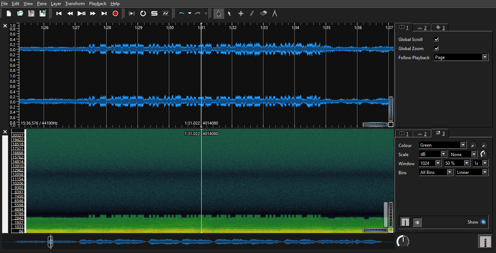

## Earth hum

<details>
  <summary>Description</summary>
  
  > [null]
  
  > Flag Format: CODEBY{}
  
</details>

Given a challenge in of a `15:36` minute WAV audio file, first we check the metadata

```bash
$ exiftool earth.wav
ExifTool Version Number         : 12.40
File Name                       : earth.wav
Directory                       : .
File Size                       : 158 MiB
File Modification Date/Time     : 2023:04:11 04:49:34+07:00
File Access Date/Time           : 2023:04:23 19:16:28+07:00
File Inode Change Date/Time     : 2023:04:21 17:29:19+07:00
File Permissions                : -rwxrwxrwx
File Type                       : WAV
File Type Extension             : wav
MIME Type                       : audio/x-wav
Encoding                        : Microsoft PCM
Num Channels                    : 2
Sample Rate                     : 44100
Avg Bytes Per Sec               : 176400
Bits Per Sample                 : 16
Title                           : Nearer My God To Thee
Product                         : Back To Titanic
Artist                          : I Salonisti
Date Created                    : 1998
Genre                           : Soundtrack
Track Number                    : 07
ID3 Size                        : 135
Warning                         : Invalid ID3 frame size
Duration                        : 0:15:37
```

We can use audio analysis tools such as Audacity, Sonic Visualizer, etc.

In Sonic Visualizer, open the Ribbon `Pane > Add Spectogram > Channel 2` and analyze each audio visual

We discovered a line at `1:24 - 1:32` we assume as Morse code after listening to it



Then, decode and compare the Morse code using these two websites

https://morsedecoder.com/


https://morsecode.world/international/decoder/audio-decoder-adaptive.html


<details>
  <summary>Flag</summary>
  
  > `CODEBY{IT1SV3RYS4D}`
  
</details>
