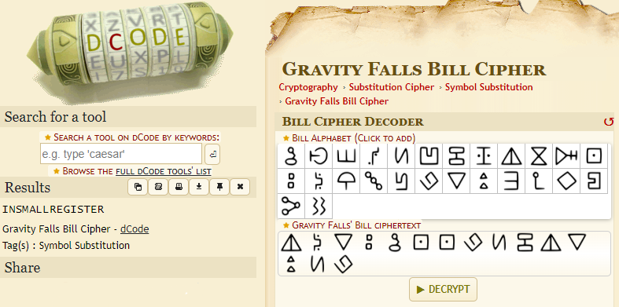

## Favorite animated series

  
Description

  
  > [null]
  
  > Flag Format: CODEBY{}
  

Given a challenge of an image file, containing random text which we found through googling to be a [Bill Cipher Alphabet](https://www.dcode.fr/gravity-falls-bill-cipher) *(from Gravity Fall's)*

  
Flag

  
  > `CODEBY{insmallregister}`
  

