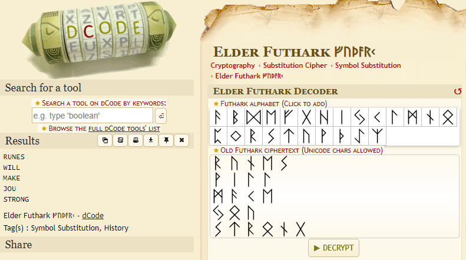

## Runes

  
Description

  
  > [null]
  
  > Flag Format: CODEBY{}
  

Given a challenge of an image file, containing ancient text which we found through googling to be a Runic Cipher or [Elder Futhark Decoder](https://www.dcode.fr/elder-futhark).

Let's decode it, and here's the result:

For the letter **J**, it's actual pronunciation may be **Y**, but the alphabet used is the same, so I will use this.

  
Flag

  
  > `CODEBY{runes_will_make_you_strong}`
  

