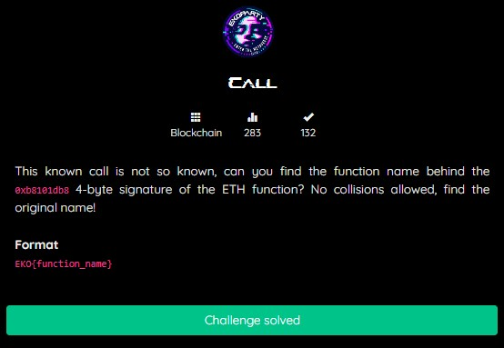
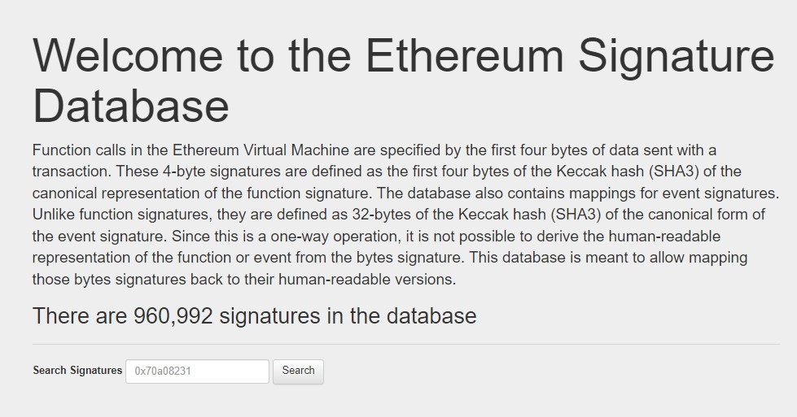
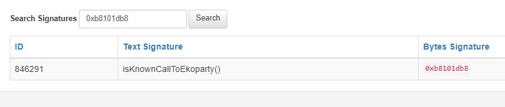

# Call
## BLOCKCHAIN


We are given a challenge in the form of address <i><b>0xb8101db8</b></i> or can be called a 4-byte signature of ETH function, 
which if we decode the address is the name of the function

I try to search on Google the 4-byte signature of the ETH function, and there will be a relevant website, 
one of the websites used to decode the function address is, https://www.4byte.directory/ <br>


I try to use the tools from the web, then search with the address given in this challenge, 
the following is the result of the decoding, the name of the function is, `isKnownCallToEkoparty()` <br>


The flag format is just a function name, without `()` <i><b>parentheses</b></i>

## FLAG
```FLAG : EKO{isKnownCallToEkoparty}```
