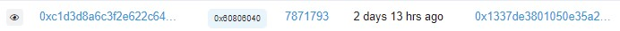

# Secrets
## BLOCKCHAIN


We are given a challenge with the BLOCKCHAIN category with the name <i><b>Secrets</b></i>, 
and given the address of the Ethereum blockchain transaction, which is contract <i><b>0x5af2ca84205681B278ee3552dFB8AeBeE49610F9</b></i>

I know it's <b>Ropsten Ethereum</b>, which is an Ethereum test network that allows blockchain development testing before being placed on the Mainnet


I tried to access a website that contains transactions, addresses, tokens and other activities on https://ropsten.etherscan.io/


Then on this website I look for transaction information 
and then I enter the address that has been given, https://blockscan.com/address/0x5af2ca84205681B278ee3552dFB8AeBeE49610F9


The search results show 3 transactions, I tried to open detailed information on successful transactions. 
There is some information about the transaction in the form of <i>Transaction hash, status, block timestamp, etc.</i>
Here, it can be seen in the transaction that there is a contract address as given in this challenge


In the data input menu, there is bytecode that originally appeared as follows, <b>View Input As → Default View</b>


If I change View Input As to `UTF-8` Format here I can find the Flag:


## FLAG
```FLAG : EKO{N3v3r_P0sT_s3cr3ts!}```
