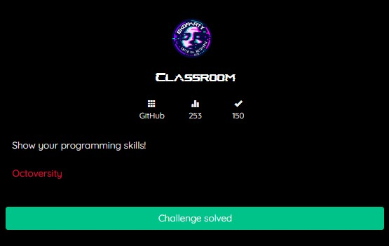
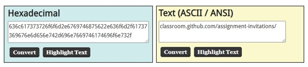
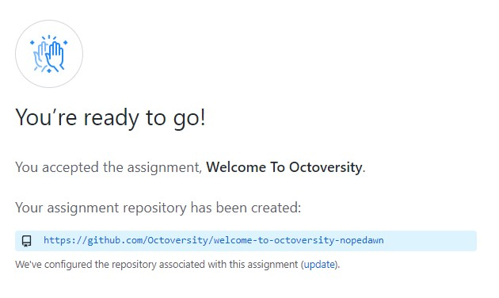
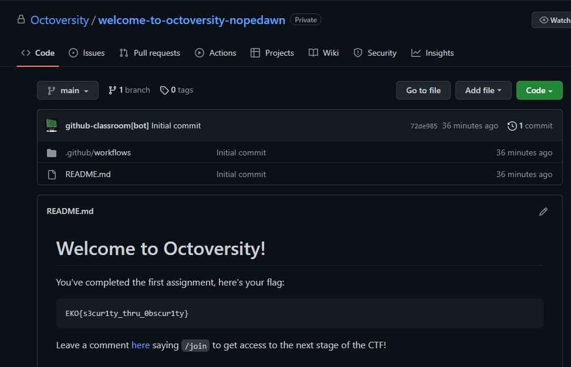

## Classroom
## GITHUB


This challenge category is GITHUB, it the first chall is named <i>Classroom</i> we given a link <i>https://github.com/Octoversity-Admissions/Admissions-Test</i> 
All we need to do is accessed the repository that has file named intro.py we need to run that then you got the output like this,


I assume that’s a link, there’s a random number, I thought it’s Hexadecimal value, and it’s right, 
I decoded that Hexadecimal value using <i>[AsciiToHex Tools](https://asciitohex.com)</i> we got output like this, <br>


Yeahh.. we got the output, now we have to assembled the link 
<br><i>https://classroom.github.com/assignment-invitations/25a94104e34a852f3af0a8a53d734fad</i>
after we entered the link, we need to authenticate to Github account agreement to entered Github Classroom,


Look, now we have to entered that link<br>
<br>
We got the first flag now 😎

## FLAG
```FLAG : EKO{s3cur1ty_thru_0bscur1ty}```
