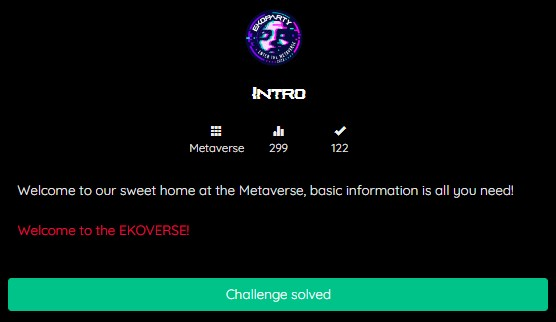
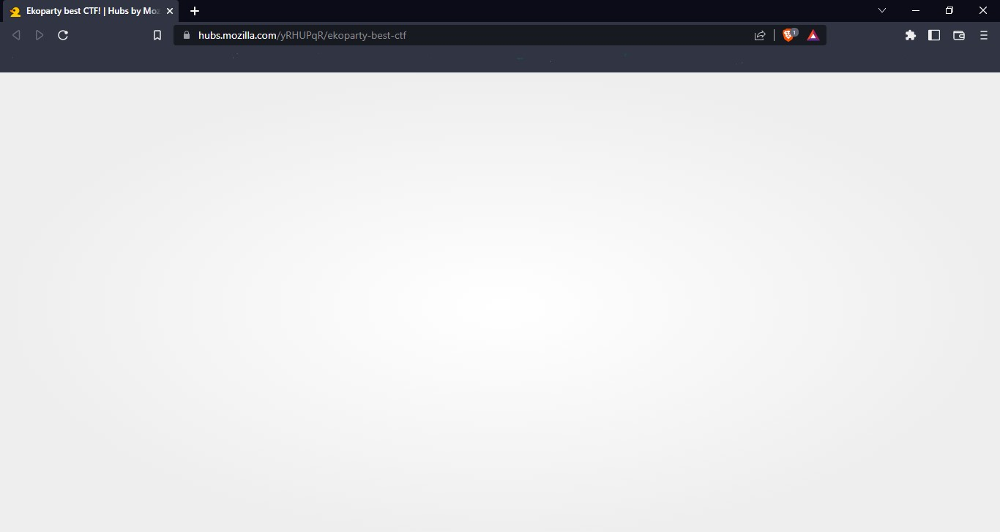
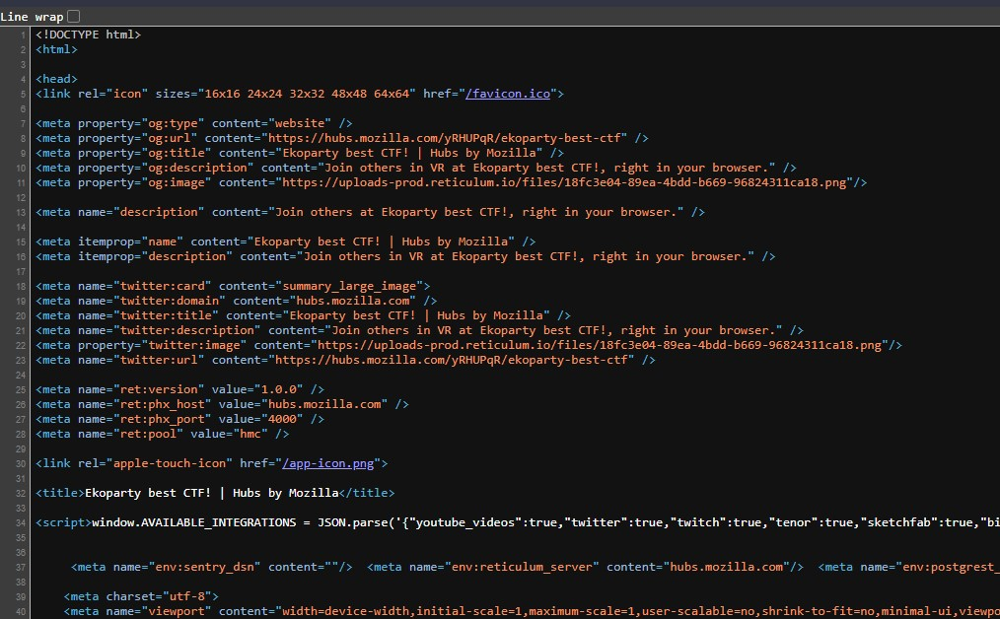
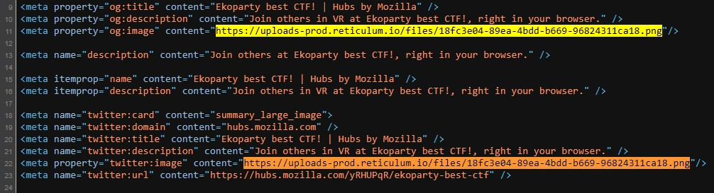
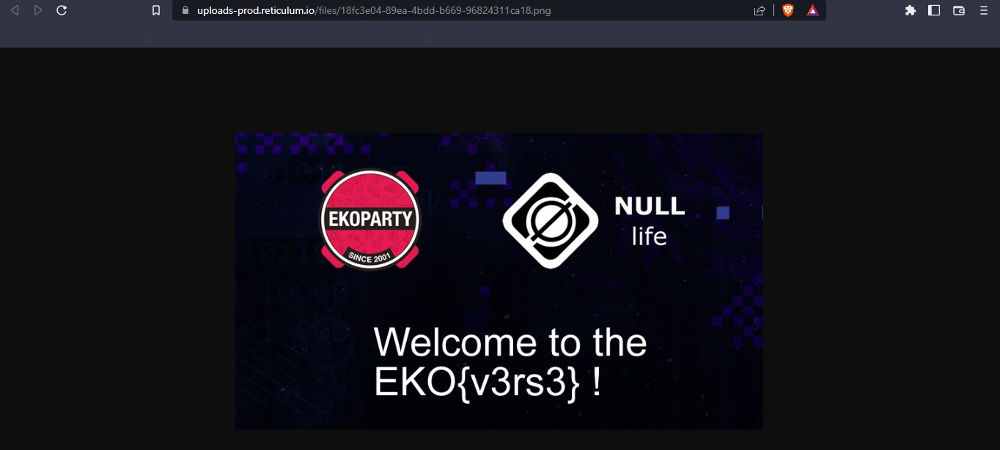

# Intro
## METAVERSE


Idk but, is Metaverse a new category of ctf ?
We given a challenge named Intro that has link into website, 
<a href="https://hubs.mozilla.com/yRHUPqR/ekoparty-best-ctf">Welcome to the EKOVERSE!</a>


It just show blank page without any informations

First thing first, the most common thing that every IT person does is identify the source of the web by Inspecting the elements of the website, it will look like this,


I just identifying to other informations, but Hmm.. sus 🤔🧐 there are same .png file https://uploads-prod.reticulum.io/files/18fc3e04-89ea-4bdd-b669-96824311ca18.png


And it’s a flag


## FLAG
```FLAG : EKO{v3rs3}```
