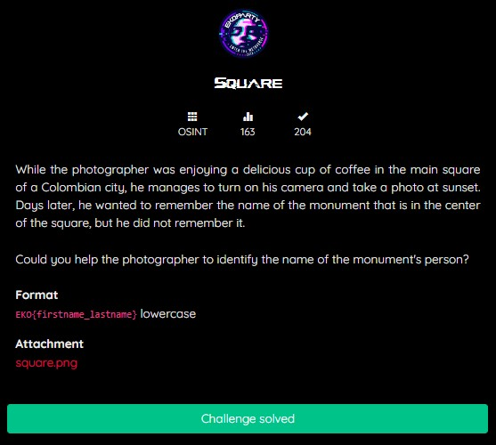
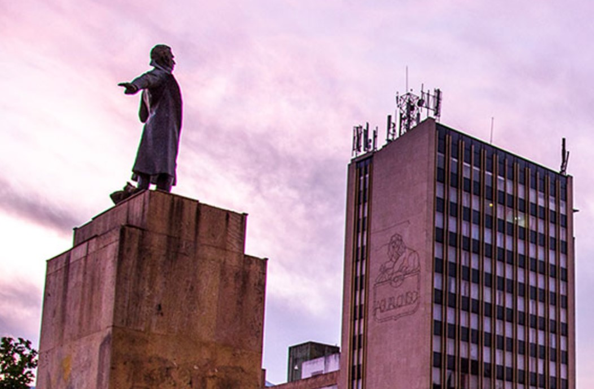
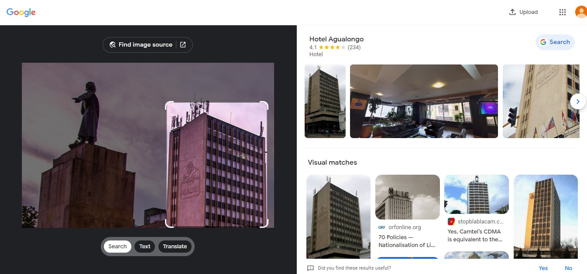
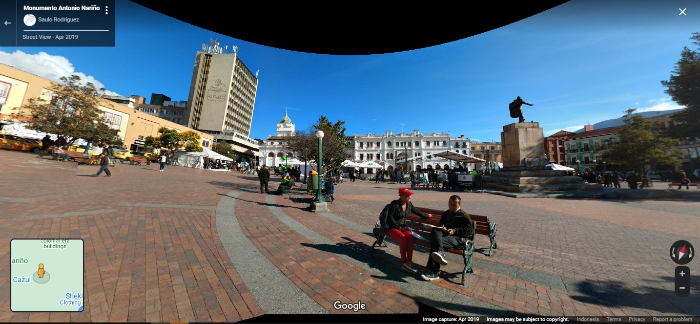
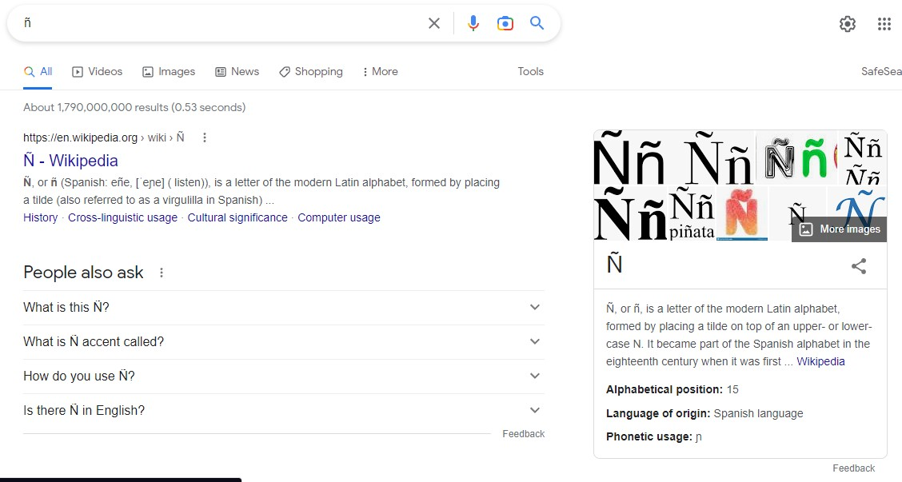
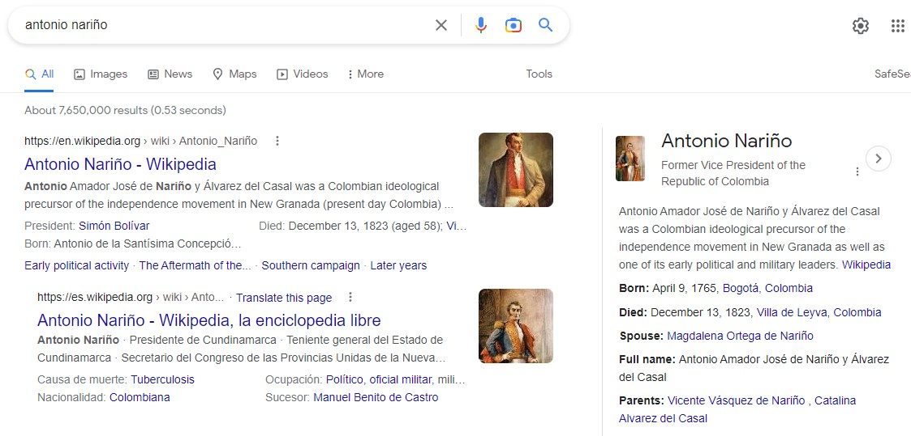

# Square
## OSINT


This osint challenge we given an image <i><b>square.png</b></i> we have to identify the named of the monument


Arround the statue it has a building, we need find that building using Google Lens


That’s building Hotel name is <i><b>Hotel Agualongo</b></i>, aight now find that hotel on Google Maps


After you look around the hotel, you have to specify the coordinate of that Monument, 
I got this coordinate POV using Google Maps, so the main square name is <a href="https://www.google.com/maps/@1.2144643,-77.2783453,3a,75y,337.14h,94.39t/data=!3m8!1e1!3m6!1sAF1QipNtn9ewrHESOKlK9mi4M9OYa6IyjFinI9dr2egY!2e10!3e11!6shttps:%2F%2Flh5.googleusercontent.com%2Fp%2FAF1QipNtn9ewrHESOKlK9mi4M9OYa6IyjFinI9dr2egY%3Dw203-h100-k-no-pi0-ya338.7283-ro-0-fo100!7i11264!8i3010">Plaza de Narino</a>
<br>
Then I just search on Google by using keyword <b>“plaza de narino statue monument”</b> then I got the statue person name, which is <b>Antonio Narino.</b>

When I trying to submit the Flag, I got the wrong submitted flag,

The flag format I submitted was correct, but it was wrong, it turns out that the original name of the person from the monument must match the alphabet,<br>


Which is wrong in the ```n``` alphabet in Spanish it should be ```ñ``` now submit using that,

<br>
So the spanish person name of that statue monument for flag is <i><b>antonio nariño</b></i>, the flag is correct now,

## FLAG
```FLAG : EKO{antonio_nariño}```
