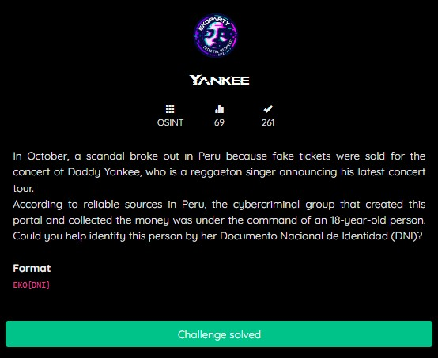
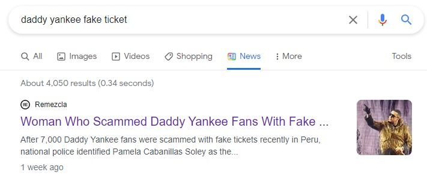
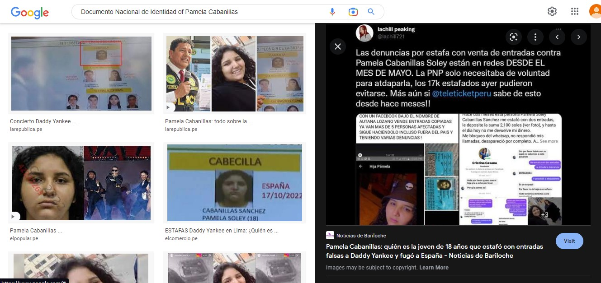
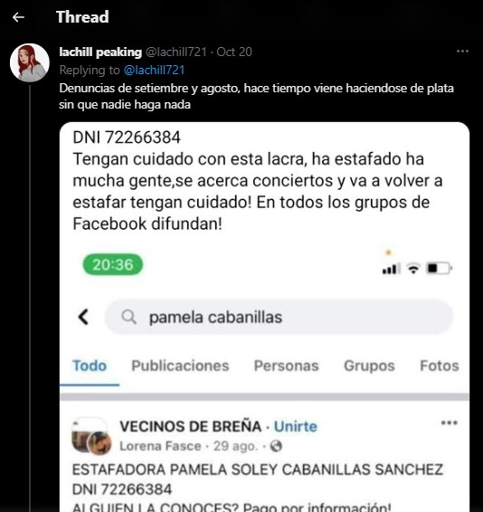

# Yankee
## OSINT


We are given a challenge like this, basically we are told to seek DNI from a girl <b>(her)</b> and that person commits a case of counterfeiting tickets for a Daddy Yankee concert, the woman is still 18 years old, and we have to identify to get a DNI (Documento Nasiconal Identidad)


I want to know that person, so I search on Google by keyword <b>“Daddy Yankee fake ticket”</b>, and it turns out that the person who faked the ticket was a girl named <i><b>Pamela Cabanillas</b></i>.

Then I just search for her DNI on google, and I found a twitter page that discussing about this person, there is a picture of that person's DNI, then I visited that twitter page at https://twitter.com/lachill721/status/1582889263233871872


The twitter account replies to his own post, and attaches a photo that looks like this and then there is a DNI information, which is <i><b>72266384</b></i>, and that’s the flag.<br>


## FLAG
```FLAG : EKO{72266384}```
