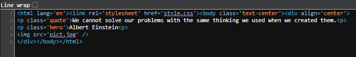
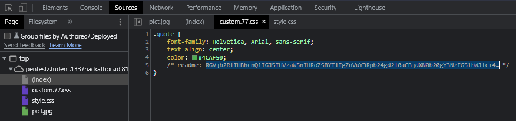
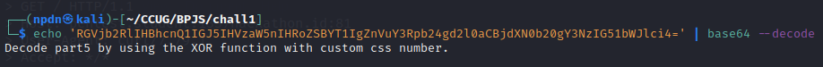
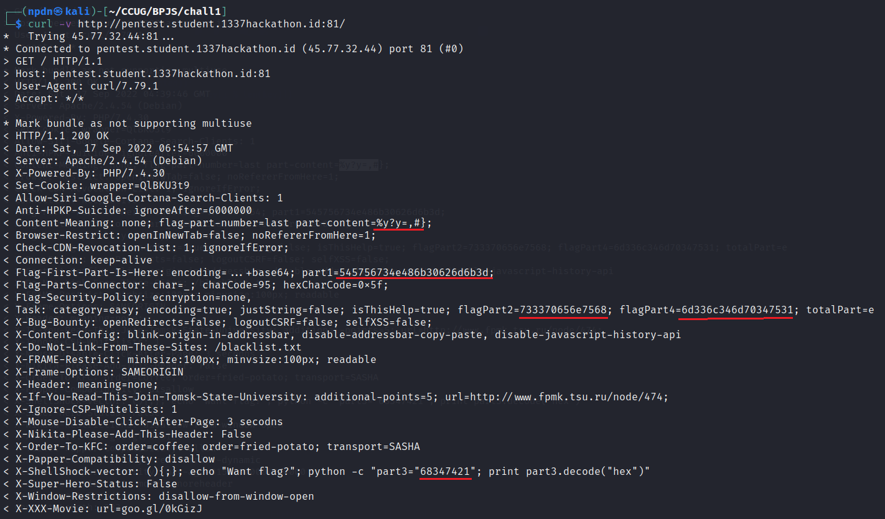
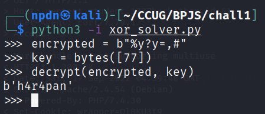

# SOAL 1
# http://pentest.student.1337hackathon.id:81/


Diberikan sebuah soal nomor 1 berupa webpage berikut, setelah itu kami cari tahu view page sourcenya seperti berikut



Kemudian kami menemukan clue pada saat kami meng-inspect halamannya, yaitu berupa base64
```
RGVjb2RlIHBhcnQ1IGJ5IHVzaW5nIHRoZSBYT1IgZnVuY3Rpb24gd2l0aCBjdXN0b20gY3NzIG51bWJlci4=
```


Setelah kami decode hasilnya seperti berikut
```bash
$ echo 'RGVjb2RlIHBhcnQ1IGJ5IHVzaW5nIHRoZSBYT1IgZnVuY3Rpb24gd2l0aCBjdXN0b20gY3NzIG51bWJlci4=' | base64 --decode
```



Singkat cerita kami coba menggunakan <b><i>curl</i></b> dengan parameter <b><i>-v</i></b> untuk mencari informasi dari url-nya, dan kami menemukan potongan flag berupa Hexadecimal
```bash
$ curl -v http://pentest.student.1337hackathon.id:81/
```



Setelah itu kami coba decode dari format Hexadecimal to ASCII dengan tools <i>https://www.rapidtables.com/convert/number/hex-to-ascii.html</i>
Didapatkanlah Flag <b>Part1</b> s/d <b>Part4</b> nya yaitu, <b><i>BPJS{Mel4y4ni_s3penuh_h4t!_m3l4mp4u1</i></b>
dan tinggal sisa <b>Part5</b> dari flagnya yaitu </b><i>"%y?y=,#}"</i></b>

Sesuai dengan cluenya yaitu <i>“Decode part5 by using the XOR function with custom css number.”</i>
Maka dari itu kami mencari script untuk memecahkan XOR function dengan custom css number dan menemukan script dari web berikut <i>https://crypto.stackexchange.com/questions/98727/how-can-i-decode-a-xor-cipher-with-a-string-key-i-know</i>

Berikut script Python-nya
```python
def decrypt(encrypted: bytes, key: bytes):
    result = []
    
    for i in range(len(encrypted)):
        result.append(encrypted[i] ^ key[i % len(key)])

    return bytes(result)
```

Lalu kami jalankan dengan command <b><i>python3 -i xor_solver.py</i></b> dan didapatkanlah <b>Part5</b> dari Flagnya yaitu <b><i>h4r4pan</i></b>
```bash
$ python3 -i xor_solver.py
>>> encrypted = b"%y?y=,#"
>>> key = bytes([77])
>>> decrypt(encrypted, key)
```



<b>FLAG : BPJS{Mel4y4ni_s3penuh_h4t!_m3l4mp4u1_h4r4pan}</b>
