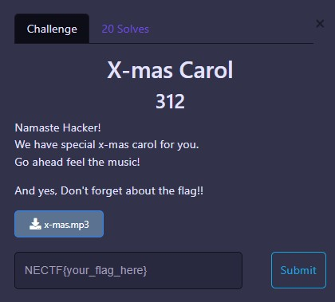
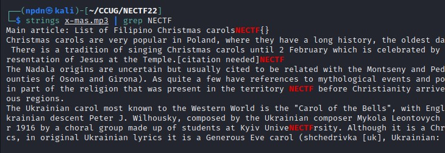
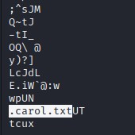
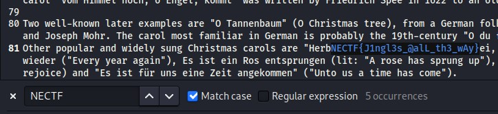

# FORENSICS

 

## X-mas Carol

We given a file `.mp3` the audio, and is just a ordinary song of christmas, and there’s a strange corrupt voice or maybe something information.

So I decided to using Audio Tools - *Sonic Visulizer* to see any information of the audio, and it doesn’t help us.

I tried to see strings of the Audio file, not just a default string of the audio, I found a many of text NECTF in the file.

Look.. there’s a `.txt` file on the last chunk of the image strings.

I extracted using `binwalk` and it’s true, the chall image contain of `carol.txt` file, then I opened that and Found the Flag.

  
FLAG :

  
  `NECTF{J1ngl3s_@alL_th3_wAy} `

