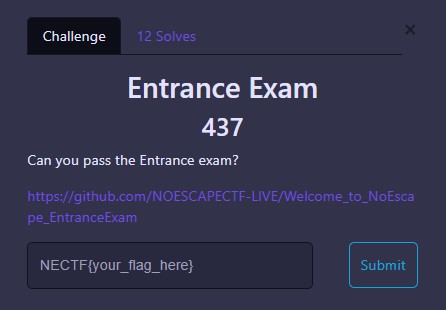
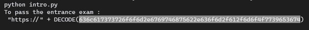
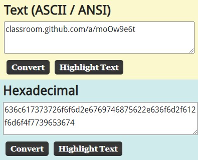
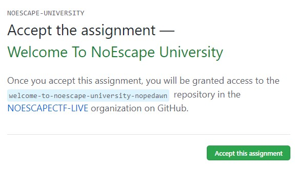
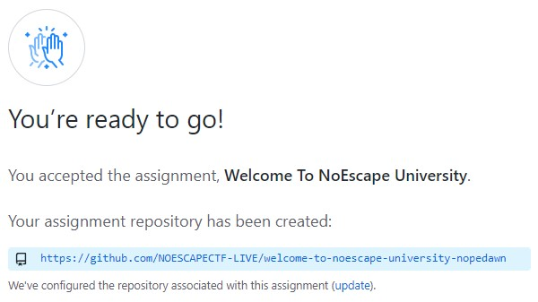
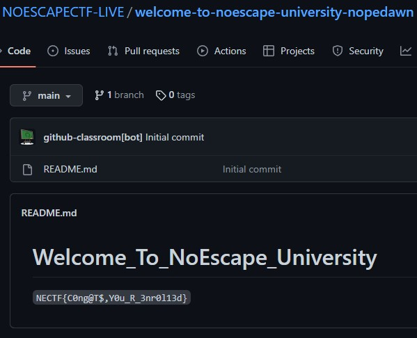

# GITHUB

<br>

## Entrance Exam


https://github.com/NOESCAPECTF-LIVE/Welcome_to_NoEscape_EntranceExam

There is a python file named [intro.py](https://github.com/NOESCAPECTF-LIVE/Welcome_to_NoEscape_EntranceExam/blob/main/Assignments/intro.py), just compiled and run it



```
636c617373726f6f6d2e6769746875622e636f6d2f612f6d6f4f7739653674
```

Just decode from Hex into ASCII using https://asciitohex.com



Here’s the result https://classroom.github.com/a/moOw9e6t

We need to enroll that classroom assignment, just Accept it






That's a flag!!

<details>
  <summary>FLAG :</summary>
  
  `NECTF{C0ng@T$,Y0u_R_3nr0l13d}`

</details>
