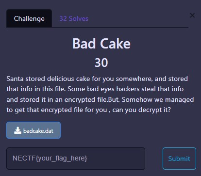
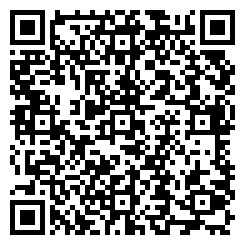
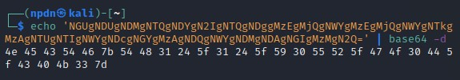
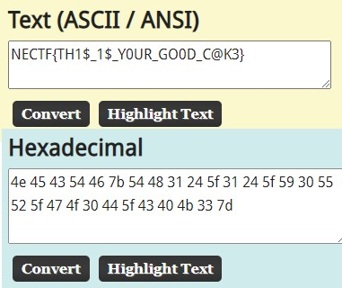
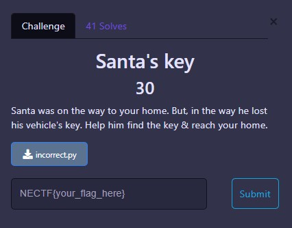
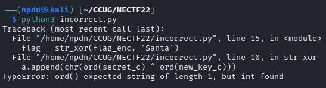
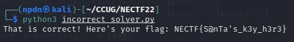
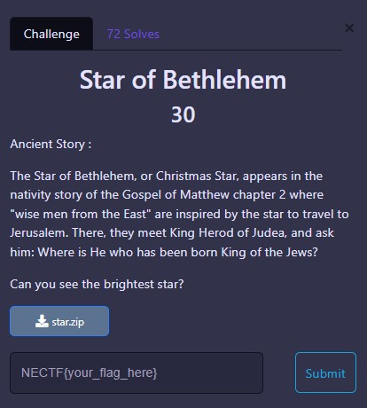
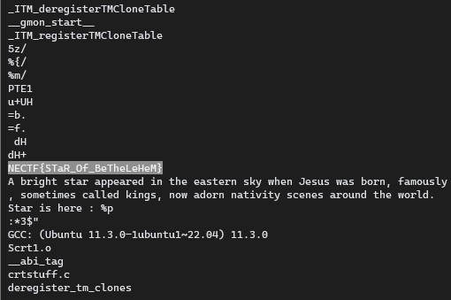

# MISC

<br>

## Welcome to NECTF


Just inspect it <b>CTRL + SHIFT + I</b>


<details>
  <summary>FLAG :</summary>
  
  `NECTF{w3LC0M3_t0_N3CTF}`

</details>

<br>

## Bad Cake


Here's a source of the `.dat` file

```
‰PNG

   
IHDR   õ   õ    ­Úì¹  ‚IDATxÚíÚAŽã0ÑÜÿÒ3Ë‚H©/Ê@$–W‰#ûy š"ùú×ñx©V­ZµjÕªUÿºúõýx;ù}­é)ßÖ~ütÝá%³»W­Zõõj°>½}vÃøégŸþZ¸{ÕªU÷PƒËø:\|þ
¼"Æ'«V­Zõäf揈Æÿáyù%U«V­:UïIZË?S­Zµê`‡:OF¿\ˏ|{UAµjÕ‡©óhùK=ØñQ­Zõ9j<Ô£tÞçˆÚ´T¹iGµjÕç¨A<,üÅÙ—ù½gÕªU7Qƒž)
Ðà[‘iï#ŸÐS­ZõÕê¼9…Q°ÀbS8ʘU«VÝDu7¢æتG›çÒ“U­Zõõjçm¥y2Ò¼©ZµêžjšñÑ-ójÞ˜Ô+³»jÕªoVÓ@QÞ7ÅHš6ƒ’¡jÕª¯V—ç>»%÷M6UT«V}˜šÎŒDþ¨oB;¹ôÿg¡ª Zµê³Õó¬’¶8öŒDÁ=ÊWU«VÝDm·£¼¼'¢Û ý2—¢ZµêKÕùú´Z8î´ÄWy1ŒTµjÕ·¨é2`4ŽŽ¸€vn^sT­Zuwu4.Bã+Ý}ƒU¢õT«VÝXM£`¥­
öÜ4U¥…B2—¢Zµê«Ô‹Sl ð‚8¦ö;-«\ÕªU_ Î|L¥¼¿®ÜŸjÕª›¨iŒŒ>‚"cÔ½ßñ·ªU«¾^M÷ÒåÖmT_ÜS2T­Zu5H-Aô¥«Ð²ä¼^™w_T«V}¿:ol€þÈ£jaÔ ©÷>T«V}¢:ÚZGm
ÚPÙ“Ü–Þ\ªU«¾Y½{`…6vç'ƒ9âRW­Zõ±jdÒ¥³¶j¾‡ST«V­:!ÉŸx‹ÍÞRW­Zõ±j#çñš¶G@’’ò¶jÕªÛ©+E¼ÊtÝnÓ'–ÅpÕªU_ ®¸¢Û¯<„Ê›EµjÕ÷«£àY9…nÚAÎe®ªU«n¢¦G¥íÚ(Í|¯Zµê&êè~+ûkx‚m>Xg¤ªU«¾OM/¼§=µi£õ¾$²ªU«î¡žçty¥™&ÍWóÌUµjÕª—H$”súê\ŠjÕª›«ic#ïä.– £g¢Zµê&jðãh$¤›óU¢Ç3UÕªU¦1rÑmÕS_ÚUQ­ZõÕêF‡jÕªU«V­Zõoÿ³üNǯÐf<    IEND®B`‚
```

I just realised there’s a PNG information in `.dat` file so I accidentaly just change the `.dat` format to `.png` format, and how unexpected the `.png` file contain a image of QR-Code



After scanning the QR-Code here’s the result, there's message in base64

```bash
NGUgNDUgNDMgNTQgNDYgN2IgNTQgNDggMzEgMjQgNWYgMzEgMjQgNWYgNTkgMzAgNTUgNTIgNWYgNDcgNGYgMzAgNDQgNWYgNDMgNDAgNGIgMzMgN2Q=
```

Then after I decoded base64, we got Hex

```bash
$ echo 'NGUgNDUgNDMgNTQgNDYgN2IgNTQgNDggMzEgMjQgNWYgMzEgMjQgNWYgNTkgMzAgNTUgNTIgNWYgNDcgNGYgMzAgNDQgNWYgNDMgNDAgNGIgMzMgN2Q=' | base64 -d
```



We can use https://asciitohex.com to decoded Hex into ASCII



<details>
  <summary>FLAG :</summary>
  
  `NECTF{TH1$_1$_Y0UR_GO0D_C@K3}`

</details>


<br>

## Santa's Key


We given a python file named `incorrect.py`

```python
def str_xor(secret, key):
    #extend key to secret length
    new_key = key
    i = 0
    while len(new_key) < len(secret):
      new_key = new_key + key[i]
      i = (i + 1) % len(key)
    a = []
    for (secret_c,new_key_c) in zip(secret,new_key):
        a.append(chr(ord(secret_c) ^ ord(new_key_c)))
    return ''.join(a)

flag_enc = 0x1d,0x24,0x2d,0x20,0x27,0x28,0x32,0x2e,0x1a,0x35,0x32,0x46,0x1d,0x2b,0xa,0x60,0x18,0x31,0x1c,0x52,0x21,0x52,0x13
flag = str_xor(flag_enc, 'Santa')
print('That is correct! Here\'s your flag: ' + flag)
```

After I execute that python file, we got an error message that we need to encrypt the Hexadecimal numbers. 



The solution is, We need to rewrite the code and changes some code, and here’s the result of code to get output like this



```python
def str_xor(secret, key):
    #extend key to secret length
    new_key = key
    i = 0
    while len(new_key) < len(secret):
      new_key = new_key + key[i]
      i = (i + 1) % len(key)
    a = []
    for (secret_c,new_key_c) in zip(secret,new_key):
        a.append(chr(ord(secret_c) ^ ord(new_key_c)))
    return ''.join(a)

flag_enc = chr(0x1d)+chr(0x24)+chr(0x2d)+chr(0x20)+chr(0x27)+chr(0x28)+chr(0x32)+chr(0x2e)+chr(0x1a)+chr(0x35)+chr(0x32)+chr(0x46)+chr(0x1d)+chr(0x2b)+chr(0xa,)+chr(0x60)+chr(0x18)+chr(0x31)+chr(0x1c)+chr(0x52)+chr(0x21)+chr(0x52)+chr(0x13)
flag = str_xor(flag_enc, 'Santa')
print('That is correct! Here\'s your flag: ' + flag)
```

<details>
  <summary>FLAG :</summary>
  
  `NECTF{S@nTa's_k3y_h3r3}`

</details>


<br>

## Star of Bethlehem


All we need to do it’s just check the list of strings of that BrightStar `ELF Shared Library` file , 
using `strings` command to solve this chall. Then we can found the flag

```bash
$ strings BrightStar
```



Got ya.. flag!!

<details>
  <summary>FLAG :</summary>
  
  `NECTF{STaR_Of_BeTheLeHeM} `

</details>
