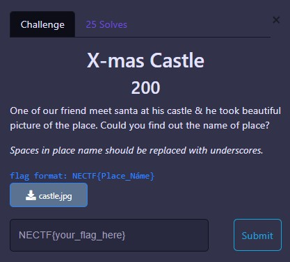
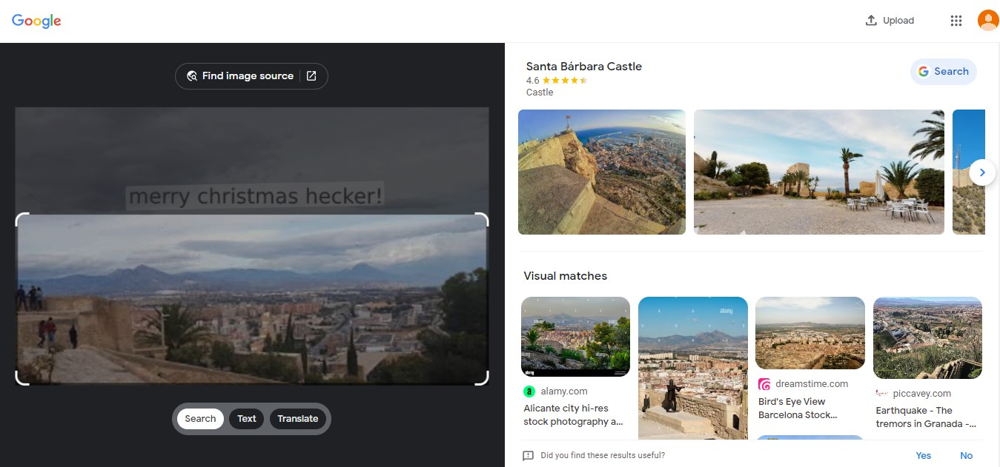

# OSINT

 

## X-mas Castle

We given an image of place and we need to identify visual of that image, so I just search it using Google Lens and we got the Place, is `Santa Bárbara`

I was submitted the flag just using  `NECTF{santa_ bárbara}` and it’s wrong, the real flag it’s include `castle` word

  
FLAG :

  
  `NECTF{santa_bárbara_castle}`

