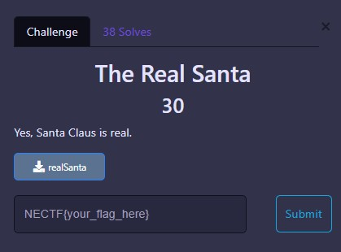
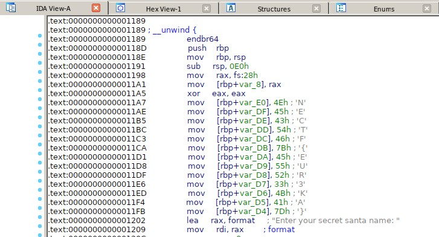

# PWN

 

## The Real Santa

We given a file of pwn chall named *realSanta*, I was thought that this chall was difficult, but this chall it’s easy.

Just open the IDA debugger and we’ve got the part of the Flag

  
FLAG :

  
  `NECTF{EUR3KA}`

