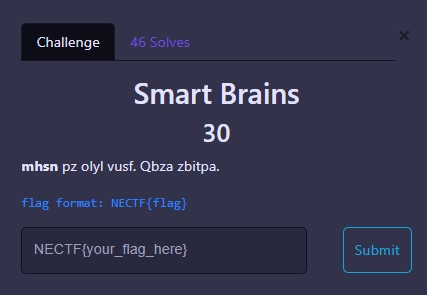
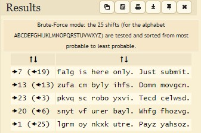

# TRIVIA

 

## Smart Brains

`mhsn pz olyl vusf. Qbza zbitpa.`

Just decode it using https://www.dcode.fr/caesar-cipher and you get the result part of the flag of any rot decode,

  
FLAG :

  
  `NECTF{falg}`

