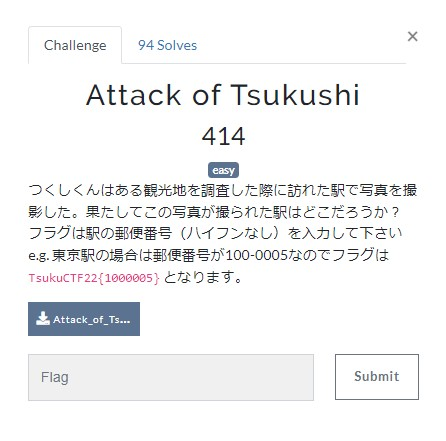
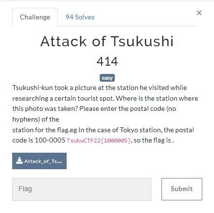
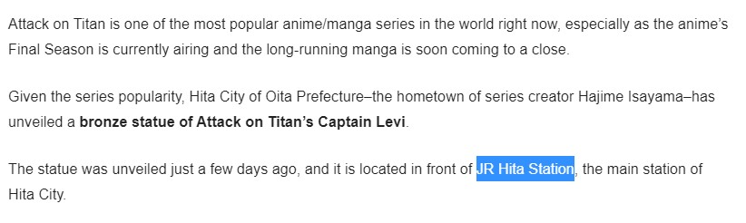
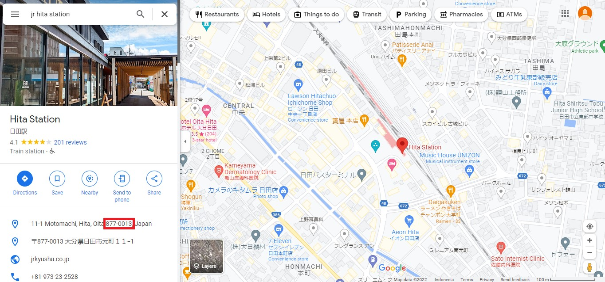

# Attack of Tsukushi
## OSINT


Sumimasen, nihongo ga jouzu wa nai desu 😅
I’m trying to translated into English


It given an image <i>Attack_of_Tsukushi.jpg</i>


I’m trying to find on Google by searching <b>Levi statue in Japan Station</b>
And I found a website that give information of that statue, in <b>JR Hita Station</b>
https://www.ungeek.ph/2021/03/attack-on-titans-levi-gets-a-statue-in-japan/


So I need to search <b>JR Hita station</b> on Google Maps, and I found the Address Information within Postal Code 
```11-1 Motomachi, Hita, Oita 877-0013, Japan``` https://goo.gl/maps/WH5aUtXt4MHX15A69

The location which located in <i>Oita Prefecture, Japan</i>
The Postal Code is: ```877-0013``` then change into flag format

## FLAG
```FLAG : TsukuCTF22{8770013}```
