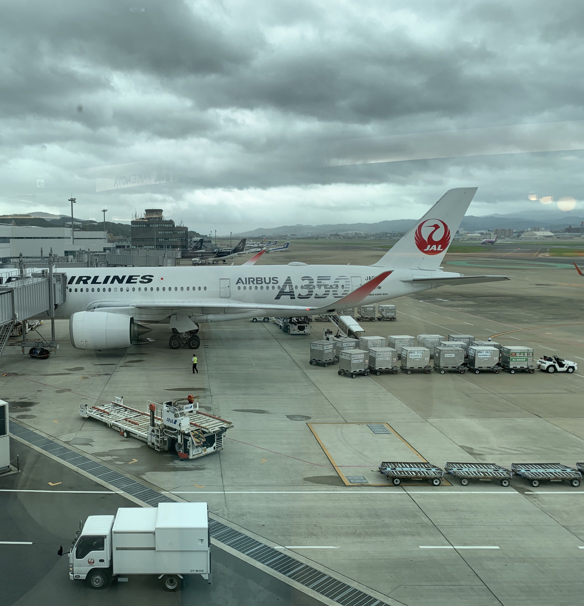

# FlyMeToTheTsukushi
## OSINT


It says 
<i>This question can only be flagged up to 10 times. *The format of the flag is TsukuCTF22{airport name}.</i>
<i>Enter only the name of the airport. (For hoge airport, only hoge is the flag)</i>




I just realize that has a word like <b>“TAKENOYA”</b>

So I just googling it, and it’s The Restaurant name


And then I just search words <b>TAKENOYA</b> within <b>Airport</b> words, and found the website look like this


Okay it’s <b>Takenoya Fukuoka Airport</b>, I’m trying to submit flag with that <b>fukuoka</b> name, and how unexpected.. the flag it’s correct :) yayy.
https://www.fukuoka-airport.jp/en/shops/takenoya.html


## FLAG
```FLAG : TsukuCTF22{fukuoka}```
