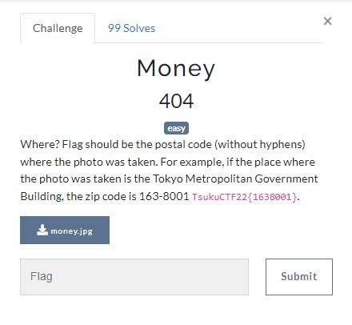
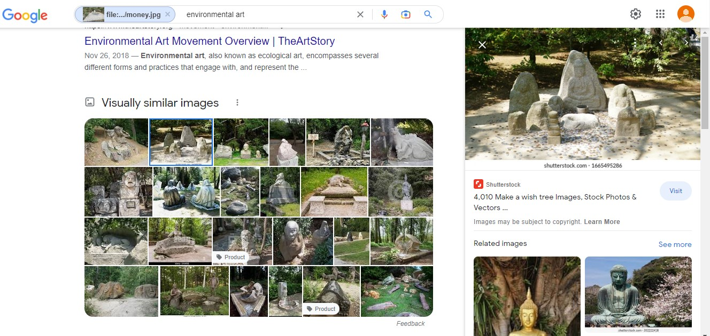
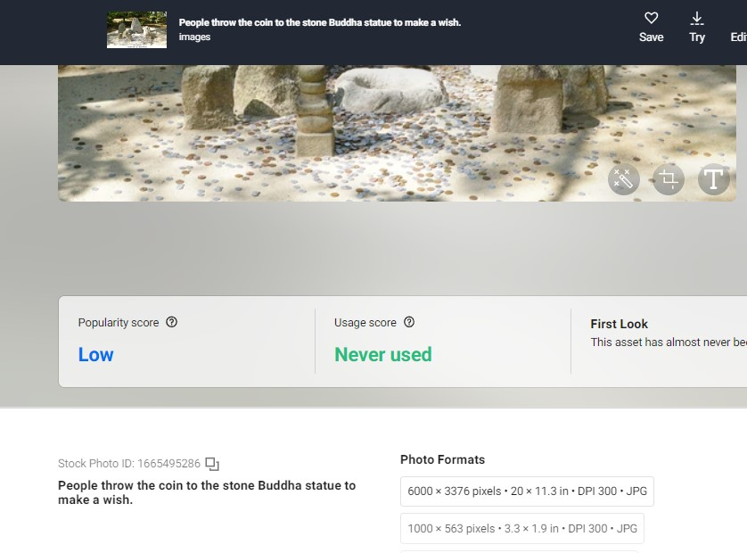
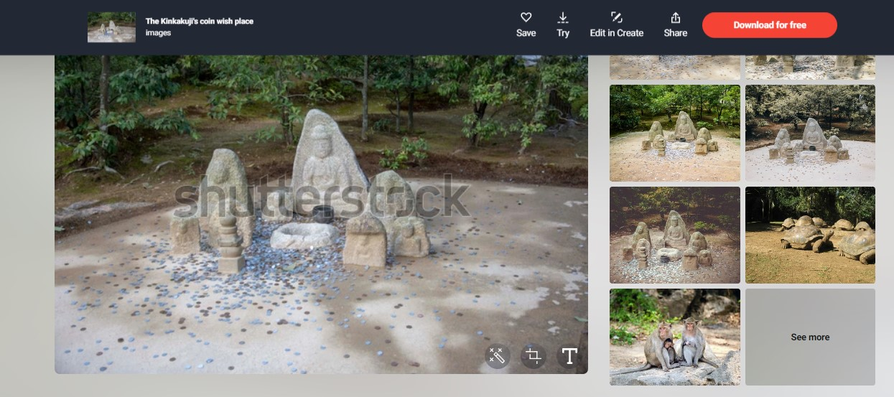
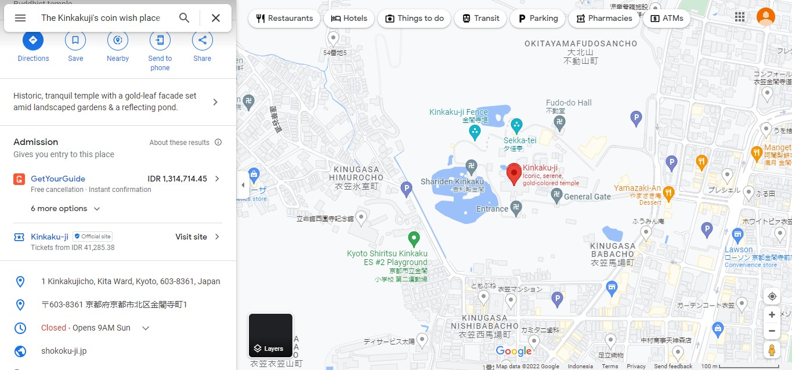

# Money
## OSINT



I need to find the Postal Code of that image place, so I search using Google Lens and found some images that looks similar

Yeahh I gottem

<br>
The image that look similar, it has in Shutterstock
https://www.shutterstock.com/image-photo/people-throw-coin-stone-buddha-statue-1665495286


I found another image that has name of that places, is <b>The Kinkakuji's coin wish place</b>
https://www.shutterstock.com/image-photo/kinkakujis-coin-wish-place-1490425859


So I search that on Google Maps, and found the place https://goo.gl/maps/WgR3XXX8xgtCRuc26


The Postal Code is ```1 Kinkakujicho, Kita Ward, Kyoto, 603-8361, Japan```

## FLAG
```FLAG : TsukuCTF22{603-8361}```
